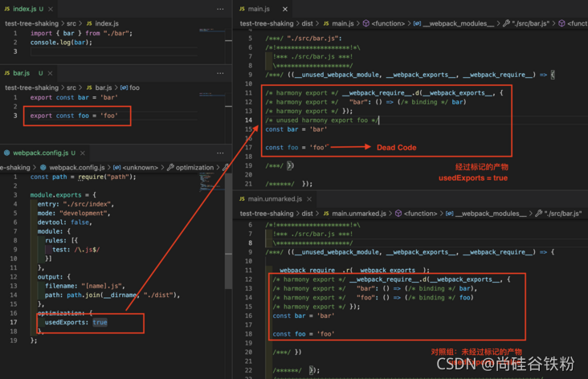

# Tree-Shaking 实现原理

## 一、什么是 Tree Shaking

> Tree-Shaking 是一种基于 ES Module 规范的 Dead Code Elimination 技术，它会在运行过程中静态分析模块之间的导入导出，确定 ESM 模块中哪些导出值未曾其它模块使用，并将其删除，以此实现打包产物的优化。

### 1.1 在 Webpack 中启动 Tree Shaking

在 Webpack 中，启动 Tree Shaking 功能必须同时满足三个条件：

+ 使用 ESM 规范编写模块代码

+ 配置 optimization.usedExports (优化已使用的导出) 为 true，启动标记功能

+ 启动代码优化功能，可以通过如下方式实现：

    - 配置 mode = production
    - 配置 optimization.minimize = true
    - 提供 optimization.minimizer 数组

<b>例如：</b>

```js
// webpack.config.js
module.exports = {
  entry: "./src/index",
  mode: "production",
  devtool: false,
  optimization: {
    usedExports: true,
  },
};
```

### 1.2 理论基础

在 CommonJs、AMD、CMD 等旧版本的 JavaScript 模块化方案中，导入导出行为是高度动态，难以预测的，例如：

```js
if(process.env.NODE_ENV === 'development'){
  require('./bar');
  exports.foo = 'foo';
}
```

而 ESM 方案则从规范层面规避这一行为，它要求所有的导入导出语句只能出现在模块顶层，且导入导出的模块名必须为字符串常量，这意味着下述代码在 ESM 方案下是非法的：

```js
if(process.env.NODE_ENV === 'development'){
  import bar from 'bar';
  export const foo = 'foo';
}
```

所以，ESM 下模块之间的依赖关系是高度确定的，与运行状态无关，编译工具只需要对 ESM 模块做静态分析，就可以从代码字面量中推断出哪些模块值未曾被其它模块使用，这是实现 Tree Shaking 技术的必要条件。


## 二、实现原理

Webpack 中，Tree-shaking 的实现一是先标记出模块导出值中哪些没有被用过，二是使用 Terser 删掉这些没被用到的导出语句。标记过程大致可划分为三个步骤：

- Make 阶段，收集模块导出变量并记录到模块依赖关系图 ModuleGraph 变量中

- Seal 阶段，遍历 ModuleGraph 标记模块导出变量有没有被使用

- 生成产物时，若变量没有被其它模块使用则删除对应的导出语句

> 标记功能需要配置  optimization.usedExports = true 开启

也就是说，标记的效果就是删除没有被其它模块使用的导出语句，比如：



# 三、 禁止 Babel 转译模块导入导出语句
Babel 是一个非常流行的 JavaScript 代码转换器，它能够将高版本的 JS 代码等价转译为兼容性更佳的低版本代码，使得前端开发者能够使用最新的语言特性开发出兼容旧版本浏览器的代码。

但 Babel 提供的部分功能特性会致使 Tree Shaking 功能失效，例如 Babel 可以将 import/export 风格的 ESM 语句等价转译为 CommonJS 风格的模块化语句，但该功能却导致 Webpack 无法对转译后的模块导入导出内容做静态分析，示例：


示例使用 babel-loader 处理 *.js 文件，并设置 Babel 配置项 modules = 'commonjs'，将模块化方案从 ESM 转译到 CommonJS，导致转译代码(右图上一)没有正确标记出未被使用的导出值 foo。作为对比，右图 2 为 modules = false 时打包的结果，此时 foo 变量被正确标记为 Dead Code。

所以，在 Webpack 中使用 babel-loader 时，建议将 babel-preset-env 的 moduels 配置项设置为 false，关闭模块导入导出语句的转译。

### 3.1优化导出值的粒度

Tree Shaking 逻辑作用在 ESM 的 export 语句上，因此对于下面这种导出场景：

```js
export default {
    bar: 'bar',
    foo: 'foo'
}
```


即使实际上只用到 default 导出值的其中一个属性，整个 default 对象依然会被完整保留。所以实际开发中，应该尽量保持导出值颗粒度和原子性，上例代码的优化版本：

```js
const bar = 'bar'
const foo = 'foo'

export {
    bar,
    foo
}
```

### 3.2 使用支持 Tree Shaking 的包
如果可以的话，应尽量使用支持 Tree Shaking 的 npm 包，例如：

- 使用 lodash-es 替代 lodash ，或者使用 babel-plugin-lodash 实现类似效果

不过，并不是所有 npm 包都存在 Tree Shaking 的空间，诸如 React、Vue2 一类的框架原本已经对生产版本做了足够极致的优化，此时业务代码需要整个代码包提供的完整功能，基本上不太需要进行 Tree Shaking。


<link>https://blog.csdn.net/zjjcchina/article/details/121159109?ops_request_misc=%257B%2522request%255Fid%2522%253A%2522169834094916800226599572%2522%252C%2522scm%2522%253A%252220140713.130102334..%2522%257D&request_id=169834094916800226599572&biz_id=0&utm_medium=distribute.pc_search_result.none-task-blog-2~all~sobaiduend~default-1-121159109-null-null.142^v96^pc_search_result_base2&utm_term=tree-shaking%20%E5%AE%9E%E7%8E%B0%E5%8E%9F%E7%90%86&spm=1018.2226.3001.4187</link>


